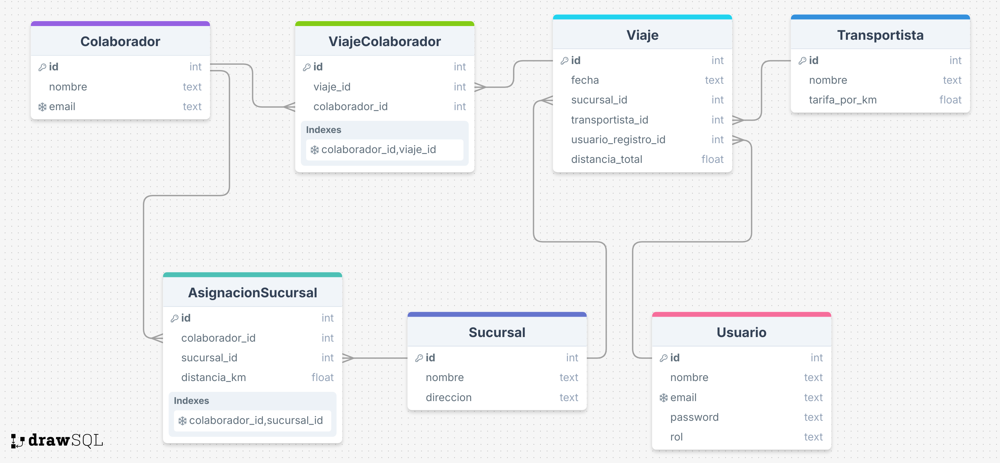

# Sistema de Gestión de Viajes para Colaboradores
Aplicativo para automatizar el registro de viajes de colaboradores, 
cálculo de pagos a transportistas y administración de sucursales.


## Requisitos
- Python 3.13+
- SQLite3 (viene con Python)
- Librerías: Ver [requirements.txt](./requirements.txt)


## Instalación y Configuración

1.  **Crea y activa un entorno virtual (recomendado):**
    ```bash
    # Crea un entorno virtual llamado "venv"
    python -m venv venv

    # Activa el entorno virtual
    # En Windows:
    venv\Scripts\activate
    # En macOS y Linux:
    source venv/bin/activate
    ```

2.  **Clona el repositorio:**
    ```bash
    git clone [Sistema de Viajes](https://github.com/Jusmet-Cast/Sistema_Viajes)
    ```

3.  **Instala las dependencias:**
    ```bash
    pip install -r requirements.txt
    ```

4.  **Ejecuta el programa:**
    ```bash
    python main.py
    ```


## Funcionalidades
- Login de usuarios con roles (Gerente de tienda/empleado).
- Asignación de sucursales a colaboradores.
- Registro de viajes.
- Reportes de pagos.


## Estructura Real del Proyecto
- sistema_viajes/ \n
- ├── db/ \n
- │   ├── data.db           # Base de datos SQLite
- │   ├── er_diagram.png    # Diagrama entidad-relación de DB
- │   └── schema.sql        # Definición de tablas
- ├── assignment.py         # Asignación sucursal-colaborador
- │── auth.py               # Autenticación y roles
- ├── db.py                 # Conexión y operaciones de DB
- ├── main.py               # Punto de entrada principal
- ├── README.md
- ├── reports.py            # Generación de reportes
- ├── requirements.txt      # Dependencias
- ├── trips.py              # Lógica de registro de viajes
- └── ui.py                 # Interfaz gráfica (Tkinter)


## Modelo Entidad-Relación (ER)
  
